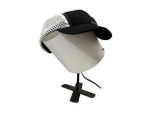
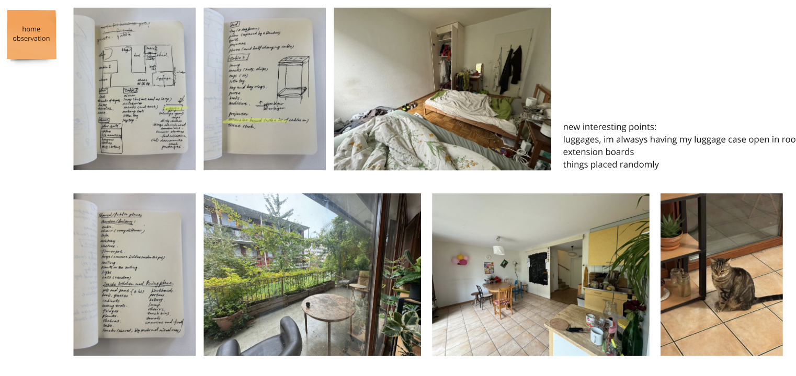
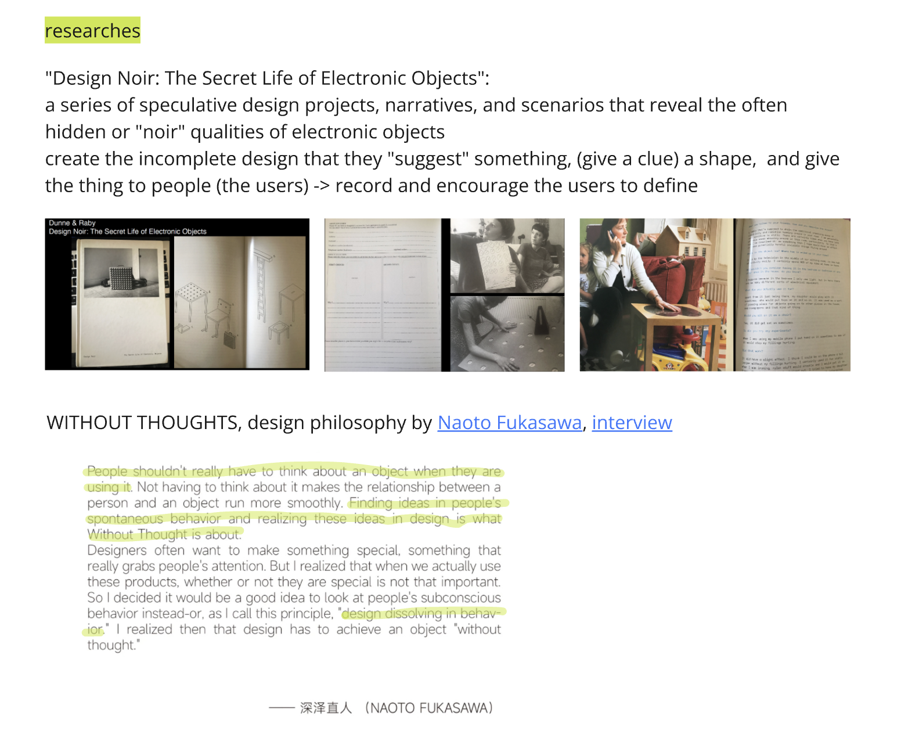
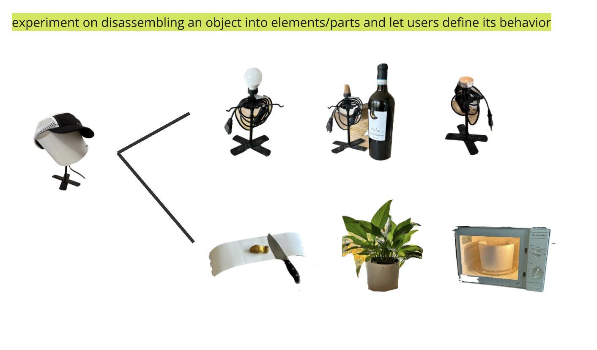
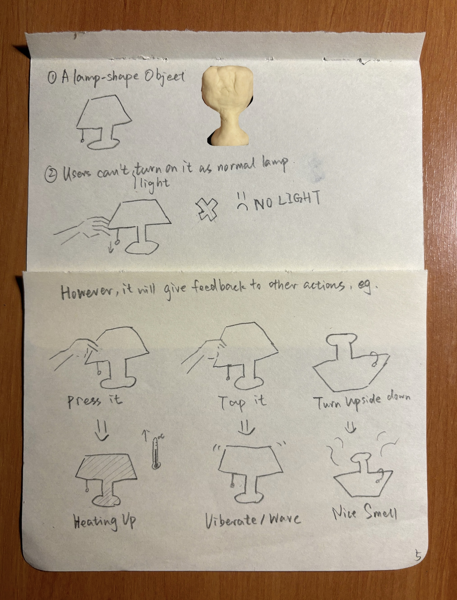
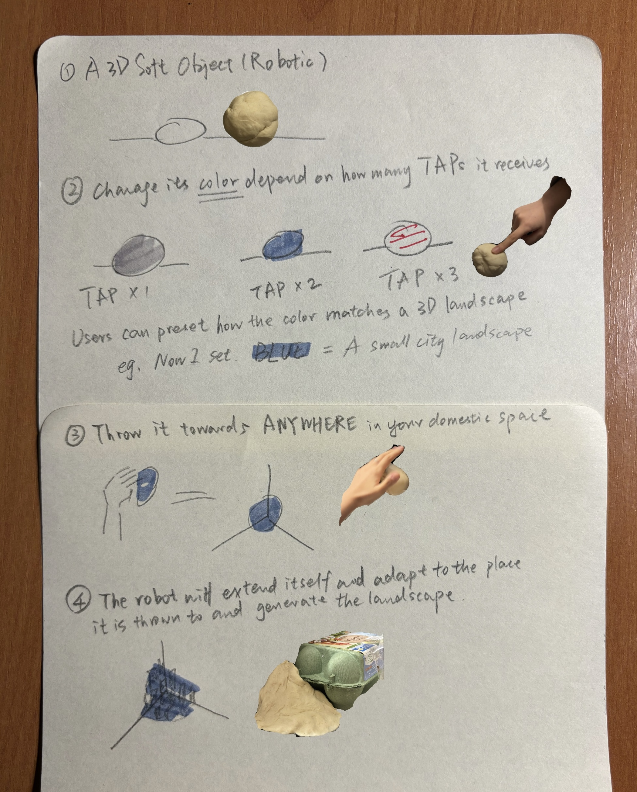
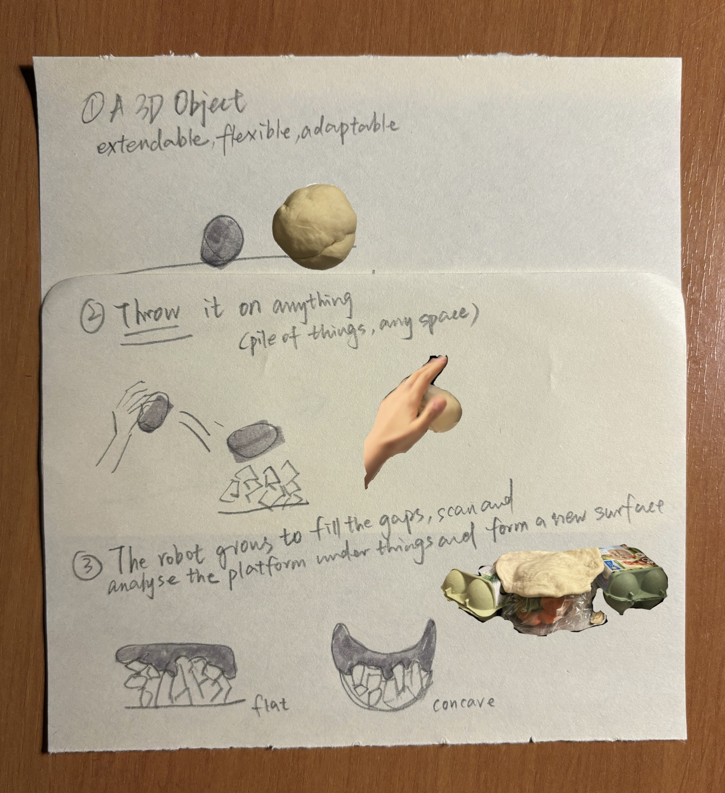

# Liuliu
- Soft Robots
- Master Media Design + O2R

## Area of intervention
The misbehaviored/misused objects in domestic spaces

## Research Question
How can objects create new functions through human interpretation?

## Research
My **observation** started from my private room, **listing and thinking** a little about all the objects inside that I see and live with everyday.

And I noticed the misused things are interesting, so I started to make a **table** for the misused things, recording where and what are them, their original and new(misused) function. And I did a short **interview** with my roommate and some appartment mates to try to find out the potential reason of the misuse.

I got stuck in the prototype design because the paradox of How can i intentionally design something that is (un)intentional interacted by human? So I researched for some reference, wanting to push the point. 

I did further **experiment** of seperateing the object and let people play with it, want to proof the possibilities of user interuption.

## Insights
- Objects in domestic spaces can gain new, unintentional identities through human interaction, and the new "misusage" is valuable or not is decided by the user.
- An object's identity and utility can be dynamically shaped by the presence and actions of people in a space

## First ideas & prototypes
Show three of your prototypes.

### 1. the misbehavior: from intentional+object to another intentional+object 
This soft robot looks like a lamp but doesn’t work like one. Instead of giving light, it reacts to touch by warming up, to tap by releasing a scent, etc. Placed on a table or bedside, it invites users to explore its unexpected behaviors and rethink everyday objects.

### 2. from unintentional+space to intentional+spaces 
This soft, moldable robot changes shape and color with touch, allowing users to create personalized landscapes in their home. By tapping it, users can control its color, and throw it into a space like a corner, it generates scenes and lighting the ignored or not fully used spaces.

### 3. from unintentional+object to (un)intentional+space
This soft, shape-shifting robot adapts to messy spaces, reshaping itself to fill gaps and create a new layer, re-defining the space without organizing or cleaning. It senses and molds to the surface it's placed on, offering a playful, tactile way to open up living areas.

## Next Steps
Jump out of the already existing thing (eg.lamp), try to create/promt some completely strange objects and let real users interact with them.