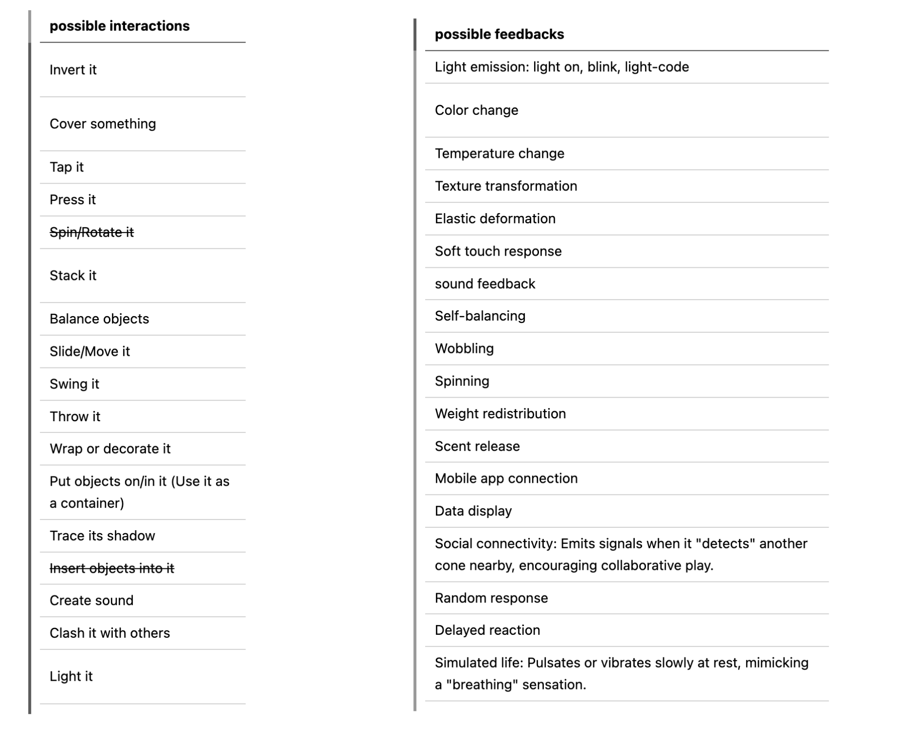

# Liuliu
- Soft Robots
- Master Media Design + O2R

## Project: Coneic

## Research Question
How can objects create new functions through human interpretation?

## Pitch
My project is a collection of playful cone-shaped soft robots that inspire people to recreate and evolve through user interaction.

## Prototyping research
- observation: the misbehavioring objects in my room

- research and references: 
    - design noir

    - Jasper Morrison's [The Unimportance of Form, 1991](https://jaspermorrison.com/publications/essays/the-unimportance-of-form)("Designing in a way that allows other aspects of an object's make-up to propose its form may be a step in the right direction.")
    - Michel De Certeau’s [The Practice of Everyday Life](https://en.wikipedia.org/wiki/The_Practice_of_Everyday_Life) [pdf](https://monoskop.org/images/2/2a/De_Certeau_Michel_The_Practice_of_Everyday_Life.pdf)(Creative Consumption, personalized usage -> secondary production)
- experiments on the forms: what makes people use it? motion, visual effect, force, stability, usage

- then prototype and interactions, decide to make it playful and have the goal that it can always surprise the users, more in the user scenario part

## Key Prototype
My project is a collection of playful, cone-shaped soft robots. My prototype is this collection of cones that react uniquely to different interactions, inspiring users to use, recreate, and evolve their functions. They are rooted in unintentional design and user innovation, inviting secondary production, and encouraging users to shape their own stories and bring them to life. 

## User scenario
video demos:
> electronics/joystickcontrolLED/demo1.mp4  
> electronics/potentiometercontrolServo/demo2.mp4  
> electronics/MPR121test_withsound/demo3.mp4  

## Next Steps
- Adding and designing more interactions
- Enriching the playful stories behind the interactions
- Combining and arranging the electronics with the prototype
