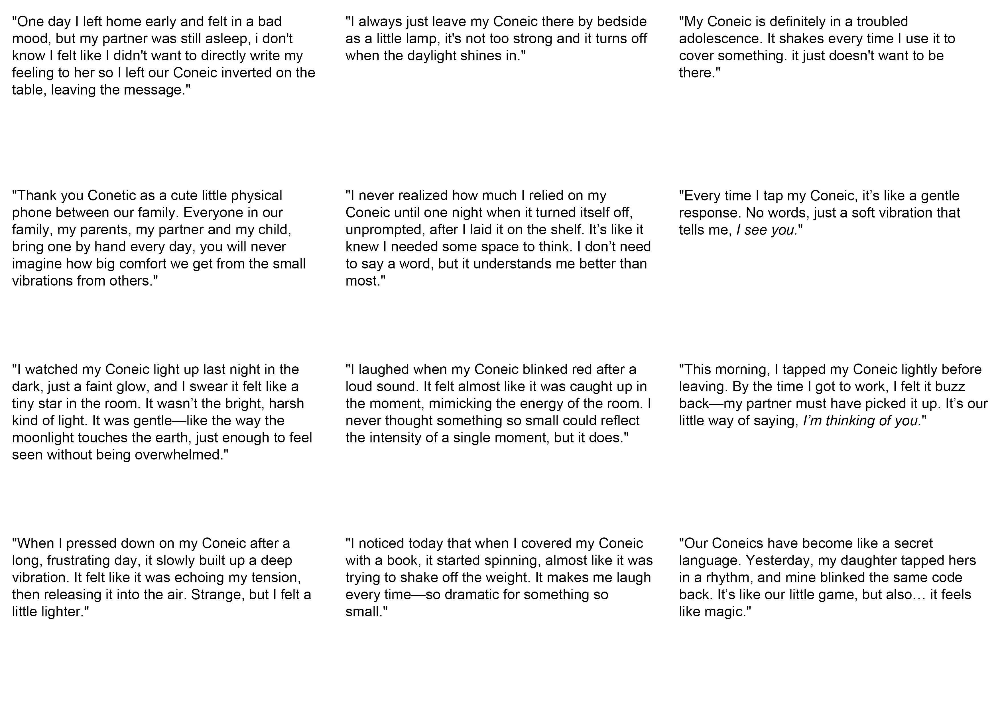

# wkshp3: Soft Robotics
This markdown file is mainly general notes and quick idea explorations during classes.

## 2024-10-14

### General wkshp brief and concept

hardware → software  
more adaptive  
more human, jump out from the typical one 
inspiration from nature, more organic  
interaction between humans and robotics 
beyond labor (don’t do labor), domestic lives 家庭生活？ more relationship 
novel combinations 
application and new usage 
paper prototype, the jury 
3D file for industrial/product design 

### References and possible tracks

[feminism](https://www.feministinternet.com/), [the good robot](https://www.thegoodrobot.co.uk) 
gestures, movements 
companion 
[MIT_personalrobots](https://www.media.mit.edu/groups/personal-robots/overview/) 
[anima](https://claire-lea.com/projects/anima-i) 
[pinaffo-pluvinage](https://pinaffo-pluvinage.com/) 
biological systems 

### Soft Robotics

robots rigides, rigid robots, 刚性机器人 
bioinspiration, octopus 
use of soft materials 
deformable structure 

### Plastic Worlds - Julien Wacquez

hard and soft; rigid and plastic; stiff and flexible 
sci-fi, Becky Chambers-a cozy revolution in sci-fi, *To be Taught, if Fortunate (2019), A Psalm of the Wild Built (2021)*
cyborg 
references: the interesting design parts in movies(avatar, terminator-liquids), animations, games(Metal gear solid 4) 

### Deep materiology and soft world - Emmanuel Docu…

we design softer ways to … 
material: sand 
hard → soft → ethereous? 
back to future 
go to zoo or 水族馆 and think about what is their intelligence. inner things, creatures 
12 proposals, 10-extension of the human body 

## 2024-10-15

[cards](https://docs.google.com/spreadsheets/d/1GpCnHk2lfN9w5SjtVgf-jJAkr7sh4xHUlj76pYzaXSo/edit?exids=71471476%2C71471470&gid=0#gid=0) [google sheet of the keywords](https://docs.google.com/spreadsheets/d/1GpCnHk2lfN9w5SjtVgf-jJAkr7sh4xHUlj76pYzaXSo/edit?exids=71471476%2C71471470&gid=0#gid=0)

### Prototype brainstorming1

from the **Solitude**, human beings increasingly need the accompany of pets, and what about pets? pets have Separation Anxiety, and there’s a Pet Attachment Theory, Biophilia Hypothesis (亲生命假说) 
a soft robotics that soft and furry, the entire body is made up of several strips, it **Glides** and move like **Waves**, less active more passive, stay and wrap in home and transfer any furniture into a “cat climbing frame” thing, would **Purr** when fill pressed (the **Tension** sensor), the interaction could be in purposed or not. 

### Prototype brainstorming2

undulate 波动 elastic 松紧带 squat 蹲，矮胖 intracellular 
art therapy, a support (size flexible, a pillow or a cup size or bed) to your body and mental health, is senses the **Breath, Undulate,** 
title: **holding your breath**  

### Domestic spaces: 

functional areas, spacial areas;  
related to human life and culture, home, social relation, identities, not just physical but dynamic space; 
embody a duality, represent both intimate family arrangements and sites for inequality [为什么我的男友和闺蜜不能同时看裸体 - 社会学的解读：场景崩塌+角色冲突，不同的人扮演的角色不同，而裸体在任意一种关系中都有其排他性和亲密性，两个场景彼此独立保持便捷，打破了就会带来角色认知冲突] 
[on slides more keywords, circulation, tracks-narrations] 

find your zone of intervention

observation start: room/shared apartments - the identities of private place and shared/public places;  during COVID, the lockdown brings to the room, 私人的空间被挤压成公共空间 

gather material and putting topics by side

## 2024-10-16

start to think about any softness that you could be inspired by
Next Monday have the area set 
Friday 1pm, 5 mins pre

## 2024-10-18

[itisasifyouweredoingwork](https://pippinbarr.com/itisasifyouweredoingwork/) 
[github repositories of it](https://github.com/pippinbarr/itisasifyouweredoingwork)
use GitHub as the documentation place  
learning how to do documentation in github

## 2024-10-21

Iteration: explore a lot of different ideas, different versions  
Interaction: communication and engagement, people <-> automated systems, refer [*The concept of “interaction” in debates on human–machine interaction*](https://www.nature.com/articles/s41599-023-02060-8) 

WHO interacts? 
HOW do theese subjects interact?  
for WHAT REASON is interaction taking place? 
under WHAT CONDITIONS (WHERE) is interaction taking place? 

ONE key interaction, the simpel the interesting, the better 
refer: [teenage engineering](https://teenage.engineering/), [play date](https://play.date/), *Katamari Damacy* (video game) 
AGENCY: user ability to perform meaningful actions and have a sense of control; their choices translate into real changes;actively engage; create a sense that user decisions matter and impact the outcome 
PERSONALITY: how you define the soft robotics, refer [superflux](https://superflux.in/#): [Our friends x electric](https://superflux.in/index.php/work/friends-electric/#) 
FEEDBACK 
INPUT/OUTPUT 

### Exercise 1
list of possible areas or specific situations where your soft robot could be used or interact within a home environment, focus on where the robot could be placed* and how it might interact with the surroundings 

Places
- corner, a place easy to be ignored but always importation for useless things
- door/wall/anyplace can hang things, these are more like free spaces in domestic place that must exist but most of the space on them is not used as the main function (eg, door mainly using the handle but not on door), so its available and free for adaption
- on table, jsut as a normal object
- under the bed or by bedside, ignored, random, handy
- in closet as a canbinet, most of them are turned into that way
- along the daily routine

### Exercise 2
list of potential interactions and geed back mechanism of the robot 

Interaction, input/output
- grow, generate into shapes that hold handy things, flexible
- play sound, to remind, or to show the existence
- light, shine as the lamp but function in different way
- heat, a little bit critical, but to avoid the handy and random use
- viberate, can be either 1 of upper 3
- movement, move following the usual daily routine of the owner of the house, to become handy 
- connect, connect with all the misused objects, contact? communicate with them or link them together, like the main brain of the IoT
- time length of the owner staying in room or putting something on it
- message
- gesture
- adapt, when thrown onto some messy things or corner, 

### Exercise 3
Using your ideas from exercises 1 and 2, write a short paragraph in markdown that describes what your soft robot does, where it resides in the home, and who it interacts with. Feed this text to an AI and begin an iterative process to refine your concept.
Following this, create a series of quick prototypes that summarize the key points from your concept and your conversations with the AI. 
AIs can be used: huggingChat, chatGPT, v0, Gemini, etc. 

>conversation with ChatG > ChatG.md

**Comments from profs (tutorial notes):** 
goes too fast, we dont need to see what the project looks like now 
go less general but put the interesting keywords  
"misusing" wrong uses  
misused robots?/gestures, the robot itself is misused  
a wrong intention in the first time  
hacking, hijack, a creative use if not the official use, personalized use
references  
people doing stupid things 
more the gesture, interaction, ... 
repurposing 
try doing a disign fiction: collecting "i have a little jellyfish robot designed in 2026, ... " sci-fi way  
not used， wired 荒诞的 
go into a future background conversation 

**Do a little research here for some ideas:** 
[Robots Failing Compilation](https://youtu.be/xl0i56oYGLE?si=Bgk-Xs5wg0kBDqmK) 
hackers gaining control over household cleaning robots, using them to shout racist slurs [report link](https://www.forbes.com/sites/larsdaniel/2024/10/16/racist-spy-robots--hackers-hijacked-vacuums-to-yell-racial-insults/) 
[Robot gets hilariously abused](https://youtu.be/0VgxAnZKM14?si=mJIhrU1QpjsDyavn) 
[PUTPUT](https://www.instagram.com/putput.dk?utm_source=ig_web_button_share_sheet&igsh=ZDNlZDc0MzIxNw==) 
WITHOUT THOUGHTS, design philosophy by [Naoto Fukasawa](https://naotofukasawa.com/),  [interview](https://designsojourn.com/naoto-fukasawa-without-a-thought/)

Bio:
parasitism -> companion organisms

## 2024-10-22

focus on interaction 
start looking at robots, interactions 
research, exploration 

STORYBOARD/SCENARIO: the experience people lived through the whole interaction, be more detailed and include all the stages; can do paper prototype and record the interaction; think of your robot as a story  
IN SUMMARY FROM YOUR SCENARIO WE MUST UNDERSTAND THE FOLLOWING
- WHERE - Where does exist?
- WHO- For who is it?
- WHAT - What is it? What does it do?
- HOW - How does it behave? How do people get the information they need?How do they interact with it? How does it communicate?
- WHY - Why does it exist?

**More comments from profs(tutorial notes):** 
functional? x  
misbehaving 
personality  
dangerous 
unfilter 
funk 
human truth go deeep  
why > go deep into the reasons 
start from observation, give more human-truth 
transformation 
hack 
personal growth 

**Comments from Ban:** 
树叶 -> 书签 
define a things into another function 
主被动关系 -> i dont originally need, but turned into 
设计一个interesting/attractive but useless thing -> user去发挥  
can be easily defined but don't know how to use 
leave the imagination space to the user 
detailed bakground, reasons  
interaction: throw -> be box 
my stuck point: this behaviors are originally very random, but now i need to design from this non-design thing 

>start prototypes and scenarios > prototypes-scenarios.md

**More comments from profs (tutorial notes):** 
still need intention 
maybe can experience around circles 
open but give it some clues, maybe its extendable 
experiments - people find definition, see what they do 
a bag - open up space, creating a space that is not there 
zip 
give it something, to adopt 
not a lamp but look like a lamp, start with the lamp shape, sth clearly not a lamp but in lamp shape 
how people use a simple string 
deconstract elements on them  

Reference recommended: design noir 
create the incomplete design that they suggest something, a shape, or wave, and give people -> give them a card and see how they define 

## 2024-11-06
presentation of prototypes and scenarios -> Miro 
>very first prototypes and scenarios > prototypes-scenarios.md

**Comments from profs(after presentation)** 
recommened refer from Chakir: [More unremarkable and odd places in Mario 64](https://www.youtube.com/watch?v=SybPxb_DjZ4&t=519s) 
3rd proto most promising, nudging, prompt from user, different types of prompting and nudging, a lot of possibilities, play with the ideas  
fill the gap, collabrating with other objects and create new one; but Suglue already 
4th idea: randomness still working with the overlooked corners, viberation, interactive, input some significance into it, not obvious, the tapping is interesting, like a reset 
feel like different transformations from one dough 
try to generate "new" objects and experiment with people [ai generator web](https://futuremirror.vercel.app/) 

Prepare tmr's presenation: templete to follow
>2024-11-07-presentation.md

## 2024-11-07
**Comments from profs and researchers after the presentation** 
a story in narrative interpretation 
[the Death of the Author](https://en.wikipedia.org/wiki/The_Death_of_the_Author) >> the Death of the Designer 
kill the designer or try to have more control on the people by misleading them? kill the designer but inviting more designers 
infinite design because of unfinished design, unfinished objects to people and they need to finish the objects, a lot of experiments 
Maybe a next-step after deconstructing the designer = author, would be to look at Michel De Certeau’s The Practice of Everyday Life: https://en.wikipedia.org/wiki/The_Practice_of_Everyday_Life
https://monoskop.org/images/2/2a/De_Certeau_Michel_The_Practice_of_Everyday_Life.pdf (Creative Consumption, personalized usage -> secondary production) 
personalized exercises: kill one and invite more, think about cues nudging people 
invitation, create strange objects 
cues nudging people, invitation, create strange objects 
more physical things next week 
think about the softness  

### Personalized Exercise
> A LIST of common objects in domestic spaces ChatG gives me: 
> Bed, couch, chairs, tables, shelves, dressers, wardrobes, bookshelves, nightstand, TV stand, lamps, ceiling light, night light, string lights, pictures, paintings, mirrors, rugs, curtains, blinds, plants, clocks, vases, television, speakers, computer, laptop, phone, tablet, game console, remote controls, chargers, books, magazines, jewelry box, clothing, bags, keys, wallet, sunglasses, shoes, baskets, boxes, drawers, containers, clothes hamper, trash bin, tissue box, pens, notepads, towels.

[get random word code](https://openprocessing.org/sketch/2435179)

Some results I get:
- books, wallet
- light, wardrobes
- boxes, mirrors
- wallet, light
- curtains, console
- table, console
- controls, couch, stand
- plants, tissue, speakers

problem: the ai generator is not creative at all and very much creating something based on the original pic, the shape and structure,, more on real combined objects 

**mid check with Alexia** 
tryo own combinition of physical things inside of collage pictures 
give some context, like a usage, not object-driven but usage-driven  
prototypes and 3D objects, more active, "invite" 
unfinish - finish 

Experiment with one action keyword and one line

but i dont know what to do with them

## 2024-11-11
Transform your concept into possible shapes, product/3D design

## 2024-11-12
intro to product design

**comments from LK and DES** 
let others finishing it
object typologies [100 chairs in 100 days](https://www.martinogamper.com/project/a-100-chairs-in-a-100-days/) 
unintentional designs
what makes people sit on it?
vessel iterations -
more generic typologies
with simplier shapes
[Jasper Morrison](https://jaspermorrison.com/publications/essays/the-unimportance-of-form)

## 2024-11-13
3D -> 2D: revolve and flatten(unroll) surfaces and add the cutlines , prepare for paper cutting

4 different geometries with the same height(h=120mm): 
- box 
- cone (r=50mm)
- cylinder, 
- sheet(A4)

Experiment with a paper sheet

Categorized based on what shape the paper is in, bended or not:

Categorized based on which part the paper is maily used:

**mid check with LK**  --
category
evolotion
shapes
cones that differently centered
no purpose - the hard point but need to let users find out

Different cones in same height and radius but different center

motion, visual effect, force, stability, usage

## 2024-11-18
electronics

U=IR 
P=UI 

## 2024-11-19
**comments from Pablo**  --
maybe also provide a menu of examples  
matrix - rearrange
金木水火土 different features but share similarities to show a collection
wood robot

## 2024-11-20
**comments from LK**   
do i want the collection still be used? or soft robot 
chain/spine in the one hand, other combinition idea? or how the virety itself can achive  

brainstorming of the forms it can have:

## final shape???????
### Shape based on cones
main basic gestures:
- Upright (bottom facing down, the most stable)
- Inverted (top facing down, unstable, but interesting motion).
- Lay sideways (bottom line in contact with the ground, great use playing with combination of edge and surface).
- Leaning (top against the wall, bottom edge on the ground, use external support to demonstrate how its geometric symmetry produces different contact forms).
- Hanging (by hanging the top or bottom of the cone, the natural vertical posture guided by gravity).
- Rolling

possibilities of addition:
- Tumbler design (adding weights to the bottom so that the eccentric cone will return to the upright position no matter how it is placed).
- Top-mounted center of gravity (adding weights to the top of the cone to make it more stable when inverted, showing mechanical balance under the guidance of the center of gravity).
- Side-weight experiment (adding weights to the side to see how the stability changes of the cone at different tilt angles).
- Dynamic tilt (installing movable weights, such as balls, inside the cone to make it show dynamic balance at different tilt angles).
- Magnetic balance? (using magnets to absorb the top or bottom of the eccentric cone so that it can rotate or tilt freely in a suspended state).
- Eccentric link (connecting multiple eccentric cones in series to make them like a chain/spine, and see how the motion can be achieved).
- Collision experiment (using multiple eccentric cones to roll or collide to observe their paths and movement patterns).
- Light and shadow experiment (using lights to place cones at different angles to observe the changes in shadows cast by their eccentric shapes).

### Movement and Interaction
for the single cones:
- seperate and combine
- viberation while tapped

for combined ones?:
- stretch and extention > move (refer: spines, [miurakit](https://interactive-structures.org/publications/2023-07-miura-kit/))

**comments from LK and AM**
cones that wait for others to use 
shape - good, interesting 
make them playful, eg, when cover something (placed upright) , it will viberate to fall down, when placed inverted, it will scream(make sound) etc 
make (possibilities)
1. one that reacts differently to differnt interactions; 
2. a collection that reacts in same sense to different interactions; refer [collection objects](https://youtu.be/v68xoidR2FA?si=nC-dEITUZ5j8EbV-)
3. a collection of cones(robots) that reacts differently to different interactions;  
Pavlov's Dog, the first experimenting part 

interactions and feedback
| possible interactions | sensor | feedback | reason |
|---|------|------|------|
Invert it|tilt sensor| sound | fall down situation
Cover something | light sensor(?) | viberate/scream | play with the user
Tap it|touchpad|blinking light|comfort
Press it|pressure  sensor
~~Spin/Rotate it~~
Stack it|IR Infrared Obstacle Avoidance Sensor
Balance objects
Slide/Move it|motion sensor
Swing it
Throw it|motion sensor
Wrap or decorate it | pressure sensor
Put objects on/in it (Use it as a container)|IR Infrared Obstacle Avoidance Sensor
Trace its shadow
~~Insert objects into it~~
Create sound | sound sensor
Clash it with others
Light it | light sensor | runaway/move | run away from light
||

| possible feedbacks | how to realize |
|---|------|
Light emission: light on, blink, light-code | LEDs
Color change | LEDs or paper machanism with paper in different colors
Temperature change 
Texture transformation
Elastic deformation
Soft touch response
sound feedback
Self-balancing
Wobbling
Spinning 
Weight redistribution
Scent release
Mobile app connection
Data display
Social connectivity: Emits signals when it "detects" another cone nearby, encouraging collaborative play.
Random response
Delayed reaction
Simulated life: Pulsates or vibrates slowly at rest, mimicking a "breathing" sensation.
||

Demo 1: a simulator, light changing interact with gestures (cheating: joystick control)
> electronics/joystickcontrolLED/

Demo 2: a simulator, potentiometer control movement
> electronics/potentiometercontrolServo/

Demo 3: touch sensor -> 
> electronics/MPR121test_withsound/

## 2024-11-29
State Machine
- [prossel open source](https://blog.prossel.info/517-state-machine-arduino-demo/)
- [jrullan git](https://github.com/jrullan/StateMachine)

## 2024-12-04
> presentations/2024-12-04-presentation.md 

**comments from researchers and DES and LK**
Introduce more function or sense / or staying creative and playful? 
With a Collection of input and output you can tell a lot of different stories
Fake-it demo 
Interesting that you don’t know which cone is doing what
Use scenarios cases
Species? on the ocean -> kids play with it, sometimes in a harsh way
Secret silent code 
Affordance of the object is really interesting 
A lot of possibilities 
Do something your partner won’t see the all thing
Divination machine
The other one is moving because one was touched? 
Douglas likes the cut
experience
keep each thing simple

**general feedback**
network 
do more and better with less 
balance of input and output 
interacting with physical materials there 
why soft robots innteresting, the elephant, difficult to control 
experiment the prototype with as much interaction with people as you can, open up possibilities 
learning algorithm/dimension? think about it for the future, adding the learning out of the interactions from people, enrich the proto, soft behavior/programming, more music-like programming, no strict definition, open object, people helping with the definition/identity 
previous step to next step 

## 2024-12-05
**comments from LK and Pablo (a saving-my-life conversation)** 
network: numbers of the cones - the more the better, for a system of showing, maybe 3 of each?
- audio 3
- light 3
- motion 3 (dc motor/viberation motor)

connect all together, more usage in remote control, use micro controllers:
- arduino bluetooth (can connect without wifi)
- ☆ wifi-based ESP 8266 board (better)

workflow: start from making one for each or one type first 
how to hide the electronics, material, color, scale: 

storybook:
- make-up stories + real ones
- more detailed
- test + reaction record

## 2024-12-08

### The highlighted part:
Light:
- single:
    - tap it - fade in and fade out
    - ? different side, different color
    - cover something - always on (like a lamp)
    - invert it - quick blink
    - light it - will on for seconds
    -? light it with different light - absorb light and show the same color (we are [light catchers](https://web.archive.org/web/20170717144505/http://www.michaelang.com/project/lightcatchers), [true color sensors](https://web.archive.org/web/20160816170307/http://www.mazet.de/en/products/jencolor/true-color-sensors))
    - make sound - light with the frequency of sound input
- network:
    - tap a code on A - B blink the code
    - convert A - B quickly blink with A

Motion: 
- single:
    - tap it - low-intensity buzz, like a small acknowledgment
    - press it - gradual vibration buildup to emphasize increasing pressure
    - cover something - rotate
    - make sound - vibrate with the frequency of sound input 
- network:
    - rotate A - B rotates in the opposite direction to A
    - tap A - B, C, D... vibrate mimicing the vibration intensity of A’s tap

## 2024-12-09
After chating with PR:

test with connecting two with wires to try the network 
esp32 feather?

## 2024-12-10
work with the LIGHTCONE

question:
- [x] touch sensor? - [link](https://github.com/PaulStoffregen/CapacitiveSensor) get some 金属片
- [x] sound sensor can't find in fritzing
- [ ] touch sensor can't find in fritzing, and if add touch sensor, surface cut?
- [ ] how to clean it to make simplier, move to to solderable board

## 2024-12-11
interaction -> sound: change to, when hear sound more than 75, blink 3 times
>electronics/PROJECT/lightcone1_ww_otouch

## 2024-12-12
test days
- observe but dont guide 
- write down the objectives: why these tests? what do i want to test? what hypotheses i want to confirm
- who and why audience?
- list tasks/interactions that need to be test - make a script
- plan technical setup - film? audio record? picture?
- welcome and intro -> pre-test interview -> moderation and observation -> post-test questionnaire
- open-end question (what do you think) not opinion
- take notes

**comments from DES** 
print a 3d plastic cone and coat it with paper 
test faking, eg. [Tesla says](https://youtu.be/oGbrQPSWrNc?si=h_bpE4ORMBM6pKjS ) 
but mine should work.. and fake the network 
whatever, need a "faking" plan 
one board need to be the wifi station or my Mac(better) 

## 2024-12-16&17
Discussion with Pablo:
- solder both arduino board (female pins) and proto shield (male pins)
- structure: arduino board underneath the proto shield
- code to pro mini [link](https://www.instructables.com/How-to-Program-Arduino-Pro-Mini-Using-Arduino-UNO/)

todo:
- [x] set the number of them and number of the network 
- [ ] decide the detailed electronics and work on them!!! - **check with PR**
- [x] combing and clean up the electronics - Pablo, female and male on board and proto shield
- [ ] modelling the part to put the eletronics, the supports
- [x] start and continue with the storybook > process/storybook.md
- [x] first do without touch sensor??? - patterns
- [x] upload code to promini ? - take a long time uploading? - 3.3v -> 5v
- [x] solder the first test day cone and electronics
- [ ] code adjustment with photocell - 250 - 300 - under sunshine ~1000, indoor~500, night indoor~300
- [ ] battery 安装 

tobuy:
budget 89/200
- [x] wifiboard * a lot - **4 arrive before christmas**
- [x] viberation motor - **Peter already buy**
- [x] speakers (check whether they have in the room), have buzzer in the kit, test first
- [ ] leds can have multi-color or strips? - **check storage room** need more RGB LED - have 2 now, need more
- [x] battery, battery sheild and battery? - **bought [WeMos D1 Mini LIPO Battery Shield V1.2.0](https://www.bastelgarage.ch/wemos-d1-mini-lipo-battery-shield-v1-2-0?utm_source=chatgpt.com) and LiPo Battery 1500mAh JST 2.0 / Lithium Ion Polymer**

questions:
- [x] same session (同一大类下的锥) totally the same or **different**?
- [x] better choice for batteries
- [x] same for different board?? - same
- [x] self made touch sensor - need conductive surface? - some cones, add patterns
- [ ] only one analog pin on each ESP8266 -?

*the Testday Coneic: LED, tilt sensor, photocell, wireless?*

storybook:

still TODO and TOBUY repack for test day:
- [x] more complicated and random code (tilt and photocell only)
- [ ] battery
- [x] storybook print and cut

## 2024-12-18 TEST DAY
test days in mind
- observe more
- why, what, when, who, where, how
- film? audio record? picture?
- welcome and intro -> pre-test interview -> moderation and observation -> post-test questionnaire
- open-end question (what do you think) not opinion
- take notes

### Feedbacks
storybook part:
- tags confusing(feel like guidelines), make them into a book/or a website showing difgitally
- leave blank pages, place a pencil or digital apple pencil to encourge engagement
- consider adding scene/settings/backgrounds to different books, eg:
    - stroybook1 (story from a family), 
    - storybook2 (story of the coneics in a shared appartent)
    - storybook3 (story of remote connection)
    - ...
- stimulate the review pages of products, with username, product bought, star rating ☆☆☆☆, comment "..."
- consider to use a opening performance(小剧场表演) to help the audiences understand

Coneic:
- ? add filters for them
- each should have one main function/feedback, so that people can see the different personalities
- reference: [sphero](https://sphero.com/): codable robot
- question: what if someone discovers an interaction and feedback, but he doesn't like it??
    - a pet or a tool? people wont be mad at pet, but mad at tools if not useful
    - add a reset button?
    - prepare backup plan code for the coneics
- different types

## 2024-12-19 
[Video sessions, Pulse Incubator](https://docs.google.com/document/d/1kgHAT8Bs2cz0OQq68X4JgVZPWP3EDckmtdBX1D-MkAc/edit?tab=t.0#heading=h.1lwmo4mdcrlc)
- Tuesday, Jan 7,13h15 Liuliu : Coneic 
- prepare before 7, video upload to [link](https://drive.switch.ch/index.php/s/Wtom21f32rCMNpa?path=%2F2.Work%20in%20Progress%2Fvideo-prototypes-2025-01-06)
    - Shoot a quick & dirty 30s video as a first attempt to communicate your project
    - a storyboard including list of all the people acting in your clip and list of all the objects/accessories/costumes for your clip

## 2024-12-20
holiday todo:
- [x] redesign the input-output of light cones and motion cones, consider the one analog pin problem
- [ ] decide the detailed electronics and work on them!!!
- [x] chat with DES about the idea of have a patterned one with touch and the dislike problem
- [ ] continue working!!
- [ ] redesign the storybook part - *mockup web* or physical print notebook
- [ ] video and storyboard, 4 working in detail, light, light, still, vibrating
- [ ] modelling the part to put the eletronics, the supports

01-06 todo:
- [ ] 3D print the support part
- [ ] battery
- [ ] video 查漏补缺 and editing

future todo:
- [ ] network

tobuy:
- [x] RGB LEDs
- [x] ESP8266 4 more
- [ ] accelerometer?

Questions: 
- enough cables? 
- How to charge?

## 2025-01-08
todo:
- [ ] cone design 4/6 - left: touch sensor part
- [ ] electronics
- [x] storybook part [*web*](https://liuliulexie.github.io/head-md-robot-web/reviews.html)
- [ ] video and storyboard, 拍一下review page scene, 细化split screen scene
- [ ] modelling the support part
- [ ] 3D print the support part
- [ ] documentation
- [ ] 
- [ ] continue working!!

future todo:
- [ ] network

Questions: 
- How to charge the cables in the mean time?Power bank?

important dates:
- 01-22 filming
- 01-15 jury day - tbd

## 2025-01-10 
**Comments from DES and AM** 
video:
- a lot of quick shot of everyday life
- the page at the end? maybe x
- more obvious
- silent cinema
- split screens of different usage 

- general shot
- people exploring 
- interaction behind different people
- ABABABABAB
- close interaction

- network
- fullshot closeup fullshot closeup fullshot closeup
- one centeral and other edges, and panover 

## 2025-01-13
Debugging of VS Code - failed, so start this new one
- delete from the history previous comit - interactive pick/edit(not showing the history commit)?
- fls - need purchase
- dirty solution - start this new one and abandon my histories...

Plan drawings

**Peter's Quick Ps and Id lesson**
 Ps：
- adjustments - levels - eyedrop - black&white
- adjustments - hue
- adjustment - colorbalance
- adjustments - selective color
- 换color调整 - yellow, magentas
- command R - rule
- 平衡校正 - mark rule上面的 - 克隆tool - option + stamp - brush that 
- 对比度
- group the effects together 
- healing tool 消除小杂质 有点像祛痘
- export -> jpg - quality -> 7
- command R + drug 加参考线
- hold c 扩展 -> generate
- mark -> 阴影 - edit - fill - …. 
- add shadow - paint use the brush
- multiply -> change 透明度

Indesign:
- shortcut of 参考线 W
- red to black
- info - printed at least 300
- link -> relink/update link

[material?](https://catrionajeffries.com/artists/liz-magor/works/liz-magor-all-the-names-iii-2014)

## 2025-01-14
[network](https://randomnerdtutorials.com/esp8266-nodemcu-firebase-realtime-database/)

documentation text refer, [lego](https://www.lego.com/en-us/aboutus/lego-group/the-lego-brand)

todo:
- [x] 回家ipad charge
- [ ] electronics, 再焊一个有ball switch的motion, 一个motion,然后检查一下led - led not working???
- [ ] network
- [x] clean up and installation set
- [ ] presentation preparation

presentation:
- +last page: future development and growing 
- the network
- developing, more possibilities and flexibility with more sensors and recoding
- material: white silicone rubber - soft, elastic, resilient, semi-transparent, brings life

presentation pdf location:
> 250115_HEAD-MD1_Soft-Robots_Liuliu-Zhu_Coneics.pdf

**Comments from AM & DES**
- the necessity network, module design
- Add the comments/user journey and network scenario to the presentation

## 2025-01-19
2nd version of presentation pdf, add the user journey
> 2 250119_HEAD-MD1_Soft-Robots_Liuliu-Zhu_Coneics.pdf

### A pack for video shooting for Peter (cuz i'll not be there TT):
electronics, at least 4 working(2light,2motion):
- 2 light cones arduino RGB LED working in real
- 3 hollow cones
- 4 well printed 3D support part
- a lot of hollow cones
- vibration motor, connect, arduino board, 2个临时连的电路和一包vibration motor
- power bank? and plug

storyboard:
- redraw with Peter, 22nd, Monday

reference:
- print the review page and shape research
- send pdf to Peter
- send the [website link](https://liuliulexie.github.io/head-md-robot-web/reviews.html) to Peter