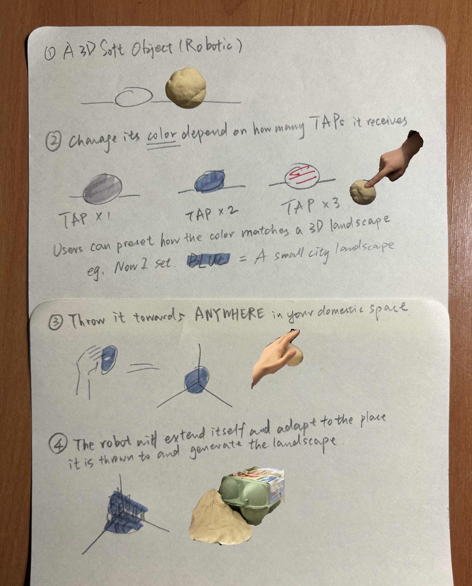

## 2024-10-22~11-3 - prototypes and storyboards/scenarios 
STORYBOARD/SCENARIO: the experience people lived through the whole interaction, be more detailed and include all the stages; can do paper prototype and record the interaction; think of your robot as a story  

IN SUMMARY FROM YOUR SCENARIO WE MUST UNDERSTAND THE FOLLOWING
- WHERE - Where does exist?
- WHO- For who is it?
- WHAT - What is it? What does it do?
- HOW - How does it behave? How do people get the information they need?How do they interact with it? How does it communicate?
- WHY - Why does it exist?

***

**my stuck point: this behaviors are originally very random, but now i need to design from this non-design thing **

definition and identity: the space and the people inside exist, then it exist or has its use, if the space and human interaction disappears, then its useless

from the observation: what people do to the domestic objects is erasing its original identity, and adding a new one to it, very open

the paradox,  unintentional， make it unintentional, which is my intention 

design philosophy: WITHOUT THOUGHTS

design something out of/from the observations of non-design behaviour

logic/inspiration briefly/brainstorming: 
- very open, from unintentional to intentional, a soft robotics that people need to explore/project
    -> use slime(simple 3D shape) as 本体, and it is extendable, the interaction people can do 是挤压，捏造->塑形, then it will remain the 造型you want and people can use it for their personal intention
- 无本身，到复原环境中的无，a soft robotic that is extendable and adaptive, people can throw on whatever messy things, then it wil fulfill the gaps of the top of the messy things and scan and analyse the "platform" under those things and recreate the original (un)intential space (for example, a lot of messy things are tiled on the floor then it will form a new flat platform/space) open up space
- 从有到另一种有，design something and but it is misbehaving/used in a different way (not a lamp but look like a lamp), sth clearly not a lamp but in lamp shape, give a clue but mislead
- 有很多，multifunctional，army knife，critical 
- seperate things and see how people do to it, 
- from unintentional space to intentional spaces, the object, if put in some space in the domestic spaces, and you can set the shape you want by touching it and changing it into different light colors, for example, you tap it twice, it becomes light red, and then you put it in a corner, and it generates a little landscape there. 

## PROTOTYPEs AND SCENARIOs

### 1. from unintentional+object to intentional+object
- **Where**: It could exist in any place in the domestic space. 
- **Who**: It is intended for individuals looking for unique and flexible objects that adapt to their multi-needs. It appeals to those who enjoy exploring, personalizing, or repurposing everyday items to make them functional in unexpected ways. 
- **What**: It looks like only simple 3D shapes. It is a flexible, highly adaptable, shape-shifting, and extendable soft robot that doesn’t have a fixed purpose; rather, users can mold and project based on their needs and creative impulses. It originally lies in its simple form, which adapts to whatever shape users squeeze or extend it into, retaining that form until reshaped. It has both utility and the novelty of organic interaction
- **How**: Users interact with it through direct touch, using their hands to squeeze, press, and sculpt it into whatever form they desire. And get feedback from its pliability and the sensation of forming it
- **Why**: explore the concept of design inspired by unintentional "design". Give the power to define to users and see what they do. 

### 2. from unintentional+object to (un)intentional+space
- **Where**: It could exist in any place in the domestic space, essentially in the part that may be messy or in need of spatial reorganization or more space.
- **Who**: It’s intended for individuals who may struggle to organize items, and want to open up space. Also appealing for people who enjoy playful things or want objects that adapt to their evolving living habits.
- **What**: It looks like only simple 3D shapes and it can autonomously reshape itself.It’s a "restoring space" robot that doesn’t eliminate mess but adapts to it, redefining functionality through unintentional design.
- **How**: When sensing the movement or thrown by users and placed over a mess or a pile of things, it fills gaps between them, and scans and understands the contour of the surface they are placed on. After detecting the underlying shapes, it molds/reshapes itself to provide a new layer on top, opens up the original (un)intentional space. Users get visual and tactile feedback as it extends and molds itself.
- **Why**: get inspired from the always open luggage which is opening up new spaces for me. The robotic doesn't aim to clean or organize but instead adapts to the existing state. 

### 3. the misbehavior: from intentional+object to another intentional+object 
- **Where**: This robot can be placed on a tabletop, bedside, or anywhere one might typically put a lamp. 
- **Who**: It attracts those interested in playful, experimental objects that challenge the routine definition of objects in the home.
- **What**: The robot is a soft and pliable structure shaped like a traditional lamp. However, instead of providing light, it has multiple other alternative functions/behaviors. Its "misbehavior" lies in the tension between its lamp-like appearance and its unexpected behaviors, encouraging users to explore what it can actually do and rethink about the objects in domestic spaces.
- **How**: Users can interact with it by attempting to "treat" it like a lamp — try switching it on but only to find it doesn’t produce light but reacts in other ways. The robot might emit a soft hum or gently vibrate, or offer warmth by slightly heating up, or spread some nice smelled perfume, or grow to cover the object putting on that. Users learn through experimentation, exploring various functions as it responds to touch, weight, or movement around it.
- **Why**: The concept explores the misleading designs, inspired by the misbehavior objects people designed in their room. By taking a familiar form/shape and purposefully shifting its functionality, the robot encourages users to challenge their assumptions about everyday domestic objects.

### 4. from unintentional+space to intentional+spaces 
- **Where**: It can exist in any part of a domestic space, depending on the users' needs and decisions.
- **Who**: It’s intended for users who enjoy transforming spaces.
- **What**: This is a soft, moldable robotic capable of changing both shape and color through simple touch gestures, like tapping or pressing. Once a user set the color and places it in a specific space—like a corner, tabletop, or shelf—it responds by creating an ambient landscape that visually reflects its new setting, using lighting effects to transform the surrounding area.
- **How**: Users touch the object, control its color by tapping gestures. For example, tapping it twice might shift it to a soft red and when placed the red mode robot in a corner, the object’s sensors analyze the location and generate a physical landscape, emitting an ambient light that fills the area with a subtle landscape effect. Tapping three times, then it becomes yellow and put it on a table, it will reshape itself into a concave. 
- **Why**: It provides users a way to personalize their environment intentionally, transforming unremarkable or ignored spaces into small landscapes. 

